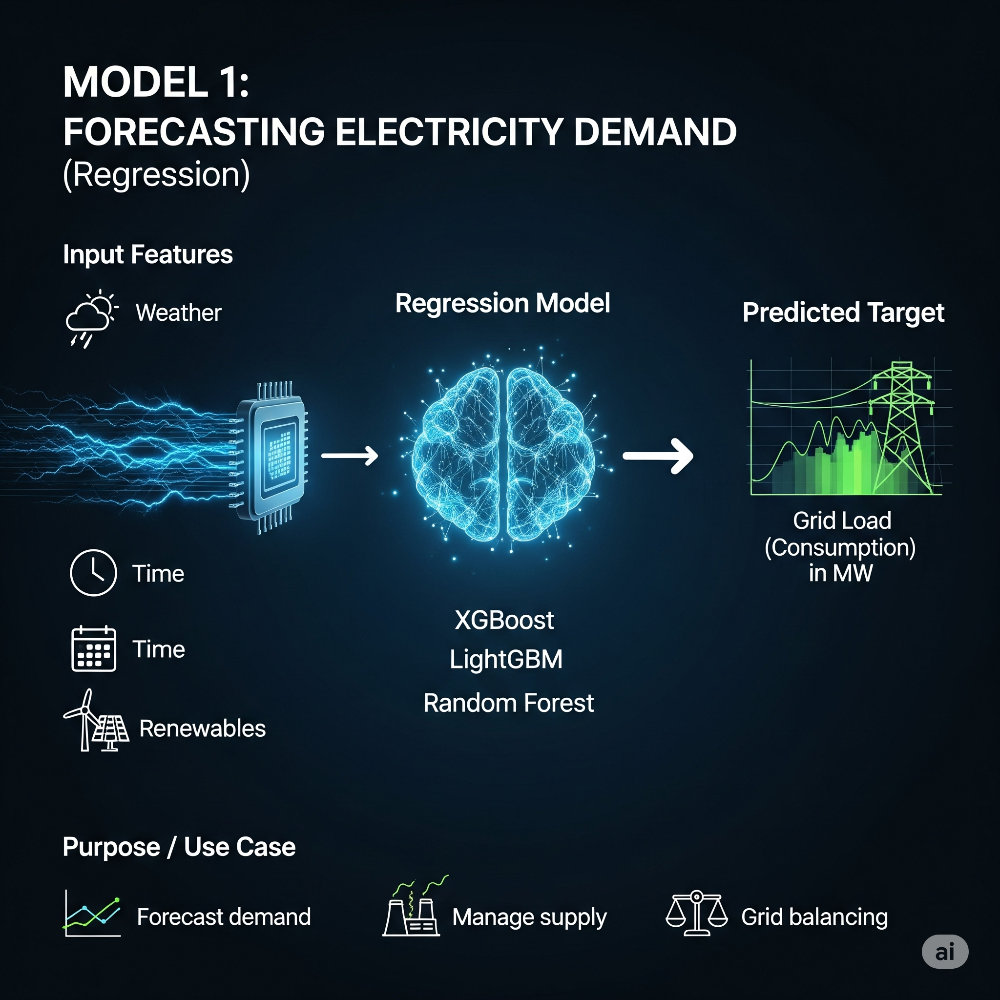

# ⚡ Grid Forecasting Dashboard (Germany)

---

## 📊 Overview
This Streamlit dashboard presents an end-to-end machine learning and exploratory data analysis (EDA) pipeline for forecasting electricity **grid load** and **renewable energy share dominance** in Germany. The project leverages historical weather and generation data to:

- Predict electricity **consumption (MW)** using regression (Model 1)
- Predict whether **renewables will supply ≥ 50%** of the load using classification (Model 2)

---

## 🧠 Key Findings

### 📌 EDA Highlights
- **Grid Load (Consumption)** is strongly correlated with:
  - `Total Grid Load incl. Hydro (0.99)` — near-perfect
  - `Actual Generation (0.89)` and `Residual Load (0.54)`
  - `Temperature (°C) (0.42)` — colder weather drives demand

- **Renewable_vs_Consumption_Ratio**:
  - Has a **bimodal distribution** — low share (<0.4) and high share (>0.6)
  - Higher during **weekends** and **spring/winter months**
  - Strongly affected by **wind speed, sunshine duration, and time features**

- **Peak Load Periods** rely heavily on:
  - **Lignite, Hard Coal, and Fossil Gas Generation**
  - **Nuclear** provides stable baseload

---

## 🤖 The Batman Pipeline

### Model 1 – Regression: Forecast Grid Load
- Trained on weather + time + generation features
- Output used as input to Model 2
- Target: `Grid Load (Consumption)`
- Model: LightGBM Regressor with custom time-aware features

### Model 2 – Classification: Predict Renewable Share ≥ 50%
- Target: `High_Renewable_Share` (binary)
- Model: Logistic Regression + ensemble tree models
- Input: All features + `Predicted Load` from Model 1

---

## 🧪 Model Tuning & Evaluation

- **Hyperparameter tuning** was done using **Optuna**, with custom pruning logic for generalization
- For `HistGradientBoostingRegressor,XGBoost,LGBM`, we used a smart pruning threshold:
  - First 20 trials: Accept `R² ≥ 0.82`
  - After 20 trials: Require `R² ≥ 0.86`
  - Penalize overfit if train-test R² gap >5%

- Final tuned model reached:
  - **Model 1 R² Score**: 0.88 (test), 0.91 (train)
  - **Model 2 Accuracy**: ~85%, **Recall on `High_Renewable_Share`**: ~79%

---

## 🎯 Dashboard Features

### 📈 Load Trends & Renewable Insights
- Seasonal + temporal behavior of grid demand
- Weekly patterns: lower load on weekends
- Renewable dominance by month, hour, and conditions

### 📊 Univariate and Bivariate Analysis
- Histograms, correlations, scatter plots
- Weekly and weekend vs weekday comparison

### 🌐 Multivariate Analysis
- Heatmap of top correlated features
- 3D scatter for interaction effects (Wind × Solar → Renewable Share)
- Feature correlation with `High_Renewable_Share`

### ⏳ Time Series
- Renewable share behavior by hour, weekday, weekend, and season

### 🤖 ML Predictions
- User interface to input weather and generation data
- Predicts:
  - Grid Load (MW)
  - Renewable Share (%)
  - Whether Renewables ≥ 50%

---
📡 Data Sources
SMARD (Strommarktdaten) – https://www.smard.de/

Germany’s official electricity market portal

Real-time & historical generation and consumption

Meteostat – https://meteostat.net/

Historical weather data from global meteorological stations

Accessed via Python API
---
📘 License

MIT License – Free to use, modify, and share.

---
👨‍💻 Author

Mohamed shaher Abaid – Built this project for applied machine learning, forecasting, and dashboarding practice using real-world data.
